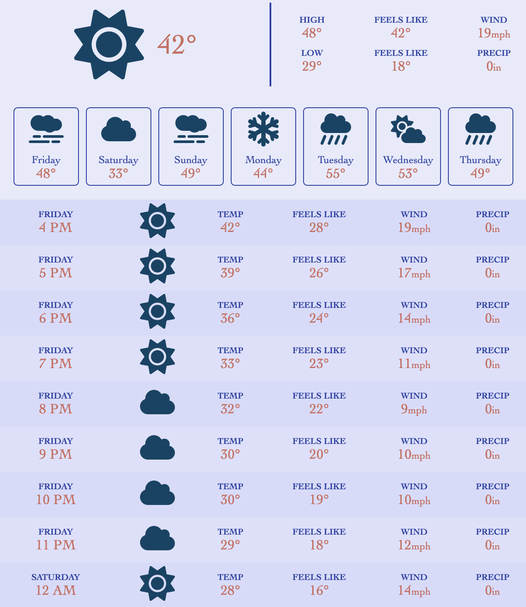

# Weather API 🌦️
**NOTE:**  
*This project is based on a [tutorial](https://www.youtube.com/watch?v=w0VEOghdMpQ)*

I used to learn about APIs. Specifically, I explored how to connect to an API, transform the data, and render it for real-time use.
 
## Overview
This web app uses [Open-Meto's](https://open-meteo.com/) [Weather Forecast API](https://open-meteo.com/en/docs) to show the current, daily, and hourly weather for the week. It updates based on the user's location.

  

## Implementation
[HTML](https://en.wikipedia.org/wiki/HTML), [CSS](https://en.wikipedia.org/wiki/CSS), and [JavaScript](https://en.wikipedia.org/wiki/JavaScript) were all utilized to craft this experience.

[Vite](https://vitejs.dev/) was used as the development environment 

## Responsive Design
A design that adapts to different screen sizes

Small            |  Large
:-------------------------:|:-------------------------:
  |  

## Credits
Thanks to [WebDevSimplified](https://www.youtube.com/@WebDevSimplified/featured) for the knowledge 
